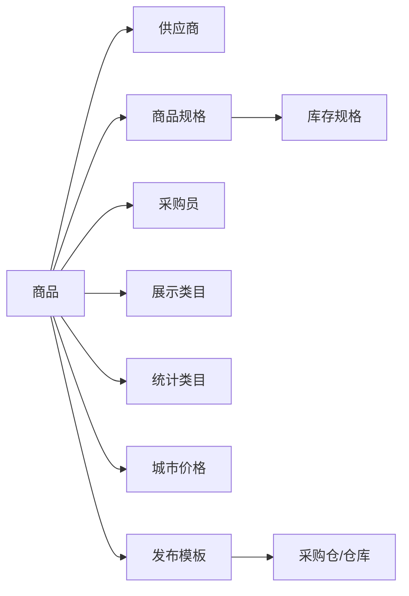
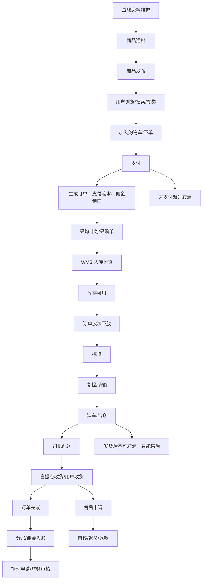
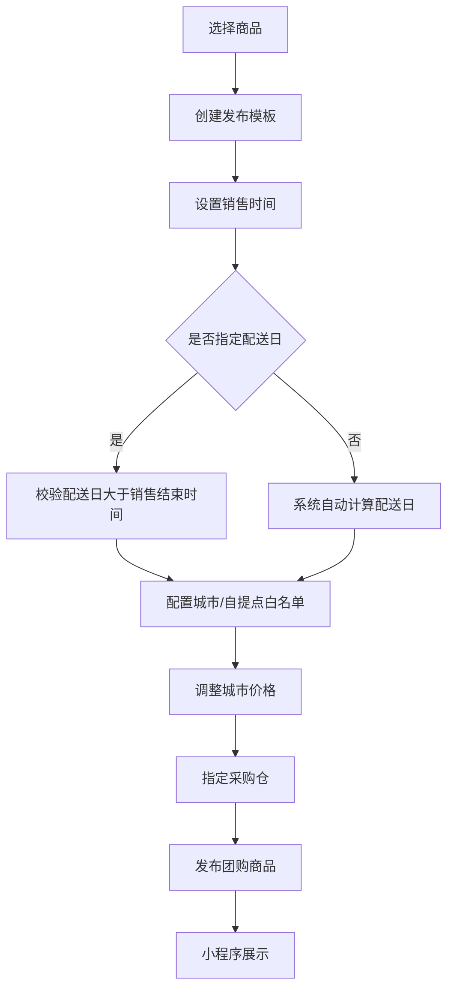
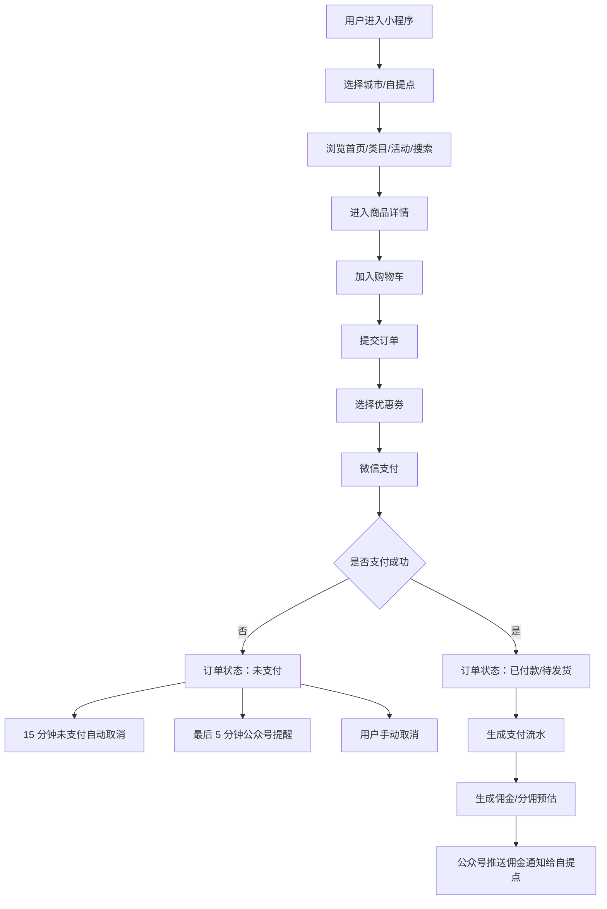
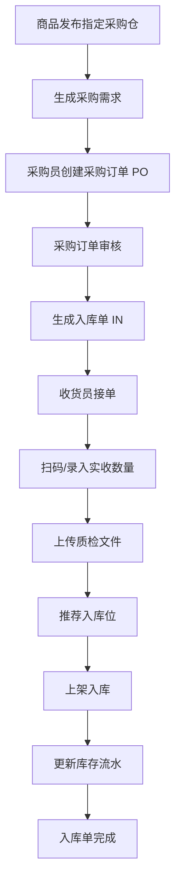
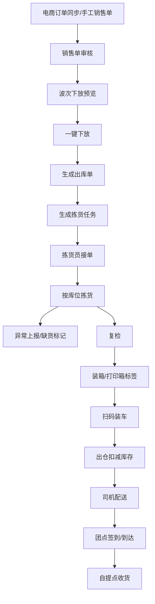
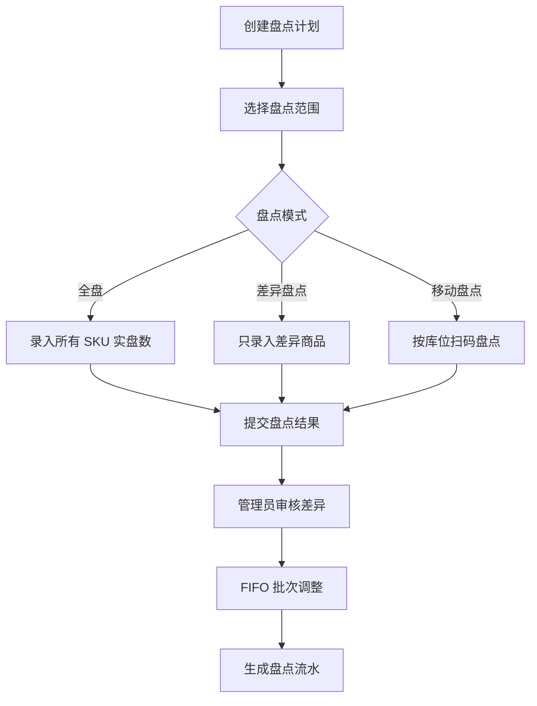
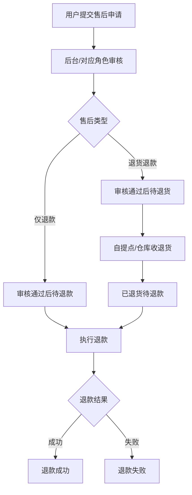
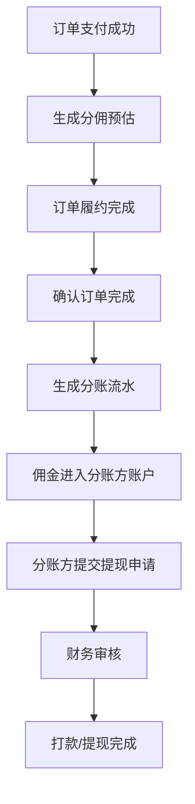

# 商城项目流程文档

编制日期：2026-06-09

## 1. 项目范围

本项目为社区团购/商城业务系统，覆盖商品建档、商品发布、用户下单、采购入库、仓储履约、配送、自提点交付、售后退款、分账提现、报表统计等完整进销存配流程。

技术栈约定：

| 层级 | 技术 |
| --- | --- |
| 后端 | Java 18、Spring Boot、Spring Cloud |
| 前端 | Vue 3、Vite、TypeScript、Element Plus |
| 数据库 | MySQL 8 |
| 中间件 | Redis、Nacos、RocketMQ、XXL-Job、Elasticsearch |
| 部署 | Docker |

## 2. 角色与端口

| 端口 | 主要角色 | 说明 |
| --- | --- | --- |
| 运营后台 | 运营、采购、财务、仓库管理员、平台管理员 | 管理商品、类目、供应商、城市、自提点、订单、售后、报表、权限、分账 |
| 用户小程序 | 普通用户 | 浏览商品、领取优惠券、下单、支付、售后、分享、切换城市/自提点 |
| 自提点小程序 | 自提点/团点负责人 | 查看订单汇总、配送汇总、佣金、提现、缺货、休假、收退货 |
| 供应商小程序 | 供应商 | 查看销售数据、售后单、商品信息、佣金、余额、提现、发票、送货单 |
| 仓配小程序/H5 | 仓库、收货员、分拣员、复检员、装车员、司机 | 采购入库、收货上架、库位管理、拣货、复检、装车、配送、盘点、报损 |
| 系统任务 | 定时任务、消息队列、搜索同步 | 自动取消未支付订单、ES 同步、商品列表刷新、公众号通知、订单分账 |

## 3. 核心业务对象关系

关键规则：

| 对象 | 规则 |
| --- | --- |
| 商品 | 一个商品对应一个供应商、多个规格、一个采购员、一个展示类目、一个统计类目 |
| 规格 | 商品规格可绑定库存规格，并配置系数转换关系 |
| 价格 | 商品需要维护三级城市价格信息，发布时可按城市调整 |
| 类目 | 展示类目和统计类目均支持多级结构 |
| 账号 | 供应商、自提点、采购员、城市、仓库创建后生成账号，可登录对应小程序 |
| 城市/自提点 | 自提点绑定城市，城市区分一二三级并设置截团时间 |
| 搜索 | 创建或修改商品后生成联想词，并同步到 Elasticsearch |

## 4. 总体业务流程

## 5. 基础资料流程

### 5.1 商品资料

1. 运营在后台创建商品基础信息。
2. 选择供应商、采购员、展示类目、统计类目。
3. 配置多个商品规格，并绑定库存规格。
4. 配置商品规格与库存规格的换算系数。
5. 配置三级城市价格。
6. 系统自动生成商品联想词，用于后续搜索。
7. 商品创建或修改后触发 Elasticsearch 同步。

### 5.2 组织与账号

1. 后台创建供应商、自提点、采购员、城市、仓库。
2. 系统为对应主体生成登录账号。
3. 不同主体登录小程序后进入对应工作台。
4. 后台通过角色、菜单权限、数据权限控制可见范围。

### 5.3 城市与自提点

1. 城市按一级、二级、三级维护。
2. 城市配置截团时间。
3. 自提点绑定城市。
4. 商品发布时可设置城市白名单或自提点白名单，限制售卖范围。

## 6. 商品发布流程

关键规则：

| 规则 | 说明 |
| --- | --- |
| 配送日期 | 配送日期必须大于销售结束时间 |
| 自动配送日 | 未指定配送日时，系统按规则自动计算 |
| 售卖范围 | 支持城市白名单、自提点白名单 |
| 城市价格 | 发布时可手动调整商品城市价格 |
| 采购仓 | 发布团购必须指定采购仓，便于后续采购和入库 |

## 7. 用户下单流程

关键规则：

| 场景 | 规则 |
| --- | --- |
| 未支付订单 | 15 分钟后自动取消，用户也可手动取消 |
| 支付提醒 | 未支付订单最后 5 分钟通过公众号通知用户 |
| 支付成功 | 生成支付流水、订单佣金/分佣记录 |
| 发货后 | 不允许取消订单，只能进入售后流程 |
| 商品售罄 | 用户可点击“想要”，后续上架后通过公众号通知 |

## 8. 采购与入库流程

WMS 入库规则：

| 环节 | 规则 |
| --- | --- |
| 采购订单 | 按供应商、仓库、商品规格创建采购计划 |
| 审核 | 审核后锁定采购订单，并生成关联入库单 |
| 收货 | 收货员通过任务池接单，支持多人员按库区并行收货 |
| 质检 | 需要质检的商品上传检验报告、合格证、溯源码等文件 |
| 上架 | 系统根据历史记录推荐库位，收货员确认后绑定库位 |
| 库存 | 入库完成后写入库存流水，更新 SKU 在库数量 |

## 9. 出库与配送流程

关键规则：

| 环节 | 规则 |
| --- | --- |
| 订单同步 | 三方电商订单自动同步，也支持后台手工销售单 |
| 波次下放 | 按配送日、路线、库存可用量生成出库任务 |
| 拣货 | 拣货员从任务池接单，按库位拣货，支持异常报告 |
| 复检 | 复检员核对拣货数量，装箱并打印箱标签 |
| 装车 | 装车员扫码箱码装车，确认后出仓 |
| 配送 | 司机查看配送路线，到团点签到并更新到达状态 |

## 10. 库存、盘点、补货流程

### 10.1 库存管理

1. 实时查询仓库、库区、SKU 库存。
2. 记录入库、出库、移库、盘点、报损库存流水。
3. 出库优先按 FIFO 批次扣减。
4. 支持库位自动绑定和团期商品库位维护。

### 10.2 盘点流程

### 10.3 补货流程

1. 后台按 SKU/库区设置最低库存阈值。
2. XXL-Job 周期检测库存。
3. 低于阈值时自动生成补货任务。
4. 管理员可创建紧急补货任务。
5. 补货员在 H5/小程序接单并执行。
6. 后台生成补货统计报表。

## 11. 售后流程

售后规则：

| 规则 | 说明 |
| --- | --- |
| 部分退款 | 支持订单部分退款 |
| 仅退款 | 不需要退货时，审核通过后可直接退款 |
| 退货退款 | 需要退货时，必须退货完成后才能退款 |
| 发货后取消 | 订单发货后不允许取消，只能走售后 |

售后状态：

| 状态 | 说明 |
| --- | --- |
| 待审核 | 用户提交售后，等待审核 |
| 已审核（待退货） | 退货退款场景，等待退货 |
| 已审核（待退款） | 仅退款场景，等待退款 |
| 已退货（待退款） | 已收到退货，等待退款 |
| 退款成功（已审核） | 仅退款审核后退款成功 |
| 退款失败（已审核） | 仅退款审核后退款失败 |
| 退款成功（已退货） | 退货后退款成功 |
| 退款失败（已退货） | 退货后退款失败 |

## 12. 分账与提现流程

关键规则：

| 规则 | 说明 |
| --- | --- |
| 分账时点 | 订单已完成后才进行分账 |
| 分账方 | 自提点、供应商、采购员等按业务配置 |
| 账户 | 分账方拥有佣金账户、余额、提现记录 |
| 流水 | 记录提成流水、分账流水、提现流水 |

## 13. 订单状态

| 状态 | 说明 |
| --- | --- |
| 未支付 | 订单已提交但未支付 |
| 已付款（待发货） | 支付成功，等待仓库发货 |
| 未支付取消 | 未支付订单超时或手动取消 |
| 已支付取消 | 已支付但未发货前取消 |
| 已发货（待收货） | 仓库已出库，等待用户/自提点收货 |
| 已收货（已完成） | 订单完成，可触发分账 |

## 14. 数据同步与消息流程

| 场景 | 触发方式 | 处理 |
| --- | --- | --- |
| 商品新增/修改 | 后台操作 | 生成联想词，同步 Elasticsearch |
| 商品列表刷新 | 定时任务 | 刷新小程序商品列表缓存 |
| 未支付订单取消 | XXL-Job/延迟消息 | 15 分钟未支付自动取消 |
| 支付提醒 | 定时任务/延迟消息 | 最后 5 分钟公众号提醒用户 |
| 支付成功 | 支付回调 | 生成支付流水、佣金记录、通知自提点 |
| 商品上架通知 | 商品状态变更 | 对点击“想要”的用户发送公众号通知 |
| 订单下放 | 后台操作/系统任务 | 生成出库单和拣货任务 |

