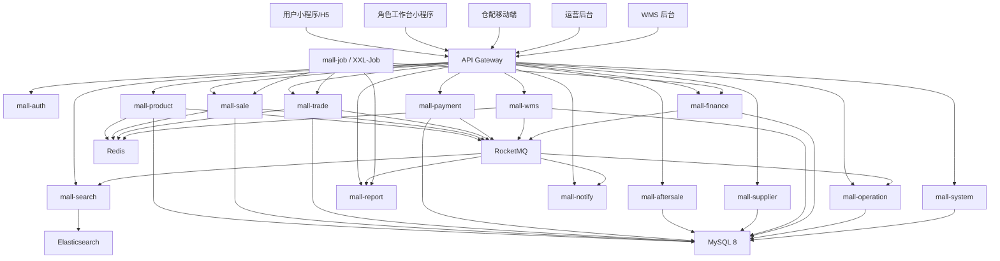
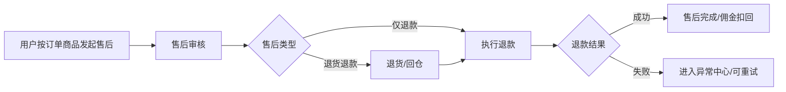

# 技术框架与项目骨架交接文档

编制日期：2026-06-24
适用阶段：UI 交互原型定版后的研发骨架搭建
拍板结论：采用“单仓多模块 + 分阶段微服务”方案，先搭清晰边界，第一版只启用核心闭环能力。

---

## 1. 结论

第一版项目骨架按“单仓多模块 + 分阶段微服务”建设。

代码结构按业务域拆分，保留后续微服务独立部署能力；第一版研发重点是商品到团期、下单支付、采购入库、WMS 出库配送、售后退款、分佣结算、提现对账、异常中心和权限追溯闭环。

第一版不建设、不暴露、不预留灰色入口的能力：

| 暂缓能力 | 第一版处理方式 |
| --- | --- |
| 积分中心、积分规则、积分流水 | 隐藏入口，不落流程、不落权限、不落系统任务 |
| 优惠券、发券、领券、用券、退券 | 隐藏入口，不参与订单、售后、财务计算 |
| 客服中心、客服工单、IM 在线沟通、机器人 | 不建模块，不展示入口 |
| 自定义 BI、拖拽报表、实时大屏、预测分析 | 只保留固定报表、固定看板、固定口径 |
| 复杂审批流配置器、会签、加签、条件分支 | 第一版只做固定审批节点 |
| 多采购仓配置、团期自提点黑白名单 | 第一版只使用一个采购仓，不做团期自提点范围配置 |
| 多级分销、城市运营分佣、用户推广佣金 | 只做已拍板的自提点、团长、供应商、平台分佣 |
| 电子签章、复杂合同模板、自动续签 | 第一版只做供应商资质、合同和押金基础风控 |
| MFA、第三方 SSO、复杂设备指纹、强制 IP 白名单 | 第一版使用账号密码登录，记录登录设备和 IP |

---

## 2. 技术栈口径

| 层级 | 技术口径 |
| --- | --- |
| 后端语言 | Java 18 |
| 后端框架 | Spring Boot + Spring Cloud |
| 服务治理 | Nacos 注册与配置中心 |
| 网关 | Spring Cloud Gateway |
| 数据库 | MySQL 8 |
| ORM | MyBatis Plus，复杂 SQL 使用 XML |
| 缓存与锁 | Redis + Redisson |
| 消息队列 | RocketMQ |
| 定时任务 | XXL-Job |
| 搜索 | Elasticsearch |
| 文件存储 | MinIO 或兼容对象存储，第一版按文件上传通用规则接入 |
| 后台前端 | Vue3 + Vite + TypeScript + Element Plus |
| 移动端 | uni-app / Vue3，拆用户端、角色工作台端、仓配移动端 |
| 部署 | Docker，后续支持 K8s |

说明：流程文档中存在 Java 8 口径，但当前项目指令和目录草案均以 Java 18 为准，研发骨架按 Java 18 执行。

---

## 3. 总体架构



架构原则：

| 原则 | 说明 |
| --- | --- |
| 按业务域拆分 | 不按 Controller、Service、DAO 技术层拆服务 |
| 先单仓聚合 | Maven 聚合工程统一构建，方便第一版联调 |
| 保留独立部署能力 | 每个业务域有独立应用入口、配置和 Dockerfile |
| 不跨库 JOIN | 服务间通过 API、事件或只读聚合视图协作 |
| 核心链路强约束 | 订单、支付、库存、财务状态机必须清晰 |
| 非核心链路最终一致 | ES、报表、消息触达、驾驶舱统计走事件和定时汇总 |
| 所有高风险动作留痕 | 发布、下架、退款、分账、提现、库存调整、导出必须审计 |

---

## 4. 后端项目骨架

```text
mall-platform/
├─ pom.xml
├─ Sql/
│  ├─ mall.sql
│  └─ changelog.md
├─ mall-common/
├─ mall-api/
├─ mall-gateway/
├─ mall-auth/
├─ mall-system/
├─ mall-product/
├─ mall-sale/
├─ mall-trade/
├─ mall-payment/
├─ mall-aftersale/
├─ mall-supplier/
├─ mall-wms/
├─ mall-finance/
├─ mall-operation/
├─ mall-user/
├─ mall-content/
├─ mall-report/
├─ mall-search/
├─ mall-notify/
└─ mall-job/
```

### 4.1 公共模块

| 模块 | 职责 |
| --- | --- |
| mall-common | Result、错误码、分页、基础实体、异常、日志、幂等、数据权限上下文、审计上下文 |
| mall-api | 内部接口契约、DTO、VO、事件对象、枚举、MapStruct 转换接口 |
| mall-gateway | 统一入口、路由、鉴权透传、限流、跨域、请求日志 |
| mall-auth | 后台账号登录、微信登录、JWT、会话、Token 刷新 |
| mall-system | 权限、角色、菜单、按钮、数据范围、字典、基础配置、系统任务配置、操作日志 |

### 4.2 业务模块

| 模块 | 职责边界 |
| --- | --- |
| mall-product | 商品基础资料、SKU、销售规格、库存规格、转换系数、类目、标签、商品审核、商品启停 |
| mall-sale | 团期管理、团期发布、销售时间、截团规则、配送日、库存模式、采购仓、发布校验、团期快照 |
| mall-trade | 购物车、订单、订单商品、订单状态、取消规则、履约状态、订单快照、缺货入口 |
| mall-payment | 微信支付、支付单、支付回调、退款单、退款回调、支付流水、退款流水 |
| mall-aftersale | 售后申请、售后审核、退货退款、仅退款、退款重试、责任归属、佣金扣回触发 |
| mall-supplier | 供应商主体、资质、合同、押金风控、采购协同、采购审核、送货单、供应商结算数据 |
| mall-wms | 采购到仓、收货入库、上架、库存、波次、拣货、复检、装车、出库、司机配送、回仓、盘点、补货 |
| mall-finance | 分佣、分账、供应商结算、自提点佣金、团长佣金、提现审核、押金释放、对账、异常资金 |
| mall-operation | 运营驾驶舱、待办中心、固定审批、异常中心、异常处理闭环 |
| mall-user | C 端用户资料、收货/提货信息、评论、用户风险标签、用户关联业务证据视图 |
| mall-content | 首页 Banner、金刚区、活动页基础配置、前台运营位、消息模板配置 |
| mall-report | 固定报表、固定看板、固定统计口径、导出任务 |
| mall-search | 商品 ES 索引、联想词、搜索、商品变更消费 |
| mall-notify | 公众号模板消息、站内消息、后台提醒、消息发送记录 |
| mall-job | 未支付超时取消、支付提醒、截团处理、采购/出库生成、消息重试、退款/分账重试、报表汇总 |

### 4.3 单服务内部结构

每个业务服务内部建议采用统一分层：

```text
src/main/java/com/mall/{domain}/
├─ {Domain}Application.java
├─ controller/        # 入口层，只做参数校验、权限、Result 返回
├─ service/           # 业务逻辑唯一归属
├─ domain/            # 领域模型、状态机、领域规则
├─ mapper/            # MyBatis Plus Mapper
├─ convert/           # MapStruct 转换
├─ dto/               # 出参 DTO
├─ vo/                # 入参 VO
├─ event/             # RocketMQ 事件
├─ enums/             # 模块内枚举
├─ config/            # 模块配置
└─ job/               # 模块内任务处理器，如有
```

资源目录：

```text
src/main/resources/
├─ mapper/
├─ application.yml
├─ application-dev.yml
└─ bootstrap.yml
```

---

## 5. 前端项目骨架

```text
web/
├─ admin/
├─ wms-admin/
├─ user-h5/
├─ role-workbench-h5/
└─ warehouse-h5/
```

### 5.1 运营后台 admin

```text
admin/src/
├─ api/
├─ router/
├─ store/
├─ components/
├─ layouts/
├─ utils/
├─ types/
└─ views/
   ├─ dashboard/
   ├─ product-sale/
   ├─ fulfillment/
   ├─ station-leader/
   ├─ supplier-purchase/
   ├─ finance-risk/
   ├─ user-marketing/
   └─ report-system/
```

运营后台一级菜单固定为：

| 一级菜单 | 第一版页面 |
| --- | --- |
| 运营驾驶舱 | 运营总览、今日经营、待办任务、异常预警、核心指标看板 |
| 商品与团期 | 商品中心、商品审核、类目中心、库存规格、团期管理、团期发布、团期详情、榜单标签 |
| 交易履约 | 订单中心、订单详情、订单商品履约明细、履约跟踪、售后中心、售后详情、缺货处理、异常中心 |
| 自提点/团长 | 自提点管理、自提点详情、休假管理、团长管理、团长审核、绑定关系、履约数据、佣金数据 |
| 供应商/采购 | 供应商管理、资质、合同、采购单、采购审核、送货单、到货追踪、供应商结算数据 |
| 财务风控 | 分账、佣金、结算、提现审核、押金、资金流水、对账、退款对账、异常资金 |
| 用户与营销 | 用户中心、用户详情、评论中心、前台运营位、Banner、活动页基础配置、消息触达 |
| 报表与系统 | 固定报表、权限、后台账号、角色、基础配置、数据字典、系统任务、操作日志、审批待办、导入记录、消息配置 |

### 5.2 WMS 后台 wms-admin

```text
wms-admin/src/views/
├─ base/
├─ inbound/
├─ putaway/
├─ inventory/
├─ outbound/
├─ picking/
├─ loading/
├─ delivery/
├─ return/
├─ stock-flow/
├─ operation-log/
└─ supervisor/
```

### 5.3 移动端

| 应用 | 定位 |
| --- | --- |
| user-h5 | 用户浏览、下单、支付、订单、售后、消息、我的页面 |
| role-workbench-h5 | 自提点/团长、供应商的角色工作台 |
| warehouse-h5 | 收货、采购协同、拣货、装车、司机配送、仓库主管工作台 |

---

## 6. 核心业务链路

### 6.1 商品到团期发布


关键约束：

- 商品是基础资料，团期是真正可售单元。
- 商品必须绑定统计类目和前台展示类目。
- SKU 必须绑定库存规格。
- 团期状态只保留：待发布、已发布、已下架、已过期。
- 团期第一版不做自提点黑白名单。

### 6.2 下单支付与履约


关键约束：

- 未支付订单 15 分钟自动取消。
- 未支付订单只允许用户取消。
- 已支付未发货订单运营可按权限取消。
- 已发货后不允许取消，只能走售后。
- 订单商品状态只保留：待履约、待出库、配送中、待自提、已自提。
- 订单下全部商品已自提后，订单主表进入已完成。

### 6.3 WMS 入库、出库、配送


关键约束：

- 库存按 SKU、仓库、批次、生产日期、保质期管理。
- 可售库存、锁定库存、在库库存、异常库存分开。
- 出库按 FIFO 扣减。
- 出库完成后司机才能打卡发车。
- 司机送达自提点后签到，默认自提点签收。
- 缺货、破损、错拣、错发、拒收进入异常中心。

### 6.4 售后、退款、佣金扣回



关键约束：

- 售后按订单商品维度处理。
- 退款待审核等处理中状态不允许重复发起。
- 已退款或已关闭售后的商品允许再次发起。
- 换货第一版不做独立流程，按补货单处理。
- 平台补偿第一版不做。

### 6.5 分佣、分账、提现


关键约束：

- 订单完成后才最终分账。
- 售后退款后允许佣金扣回为负。
- 押金是余额的一部分，但押金不能提现。
- 解除合同并手动释放押金后，才允许提走押金部分。
- 提现不能让佣金余额变负。

---

## 7. 一致性与事件设计

| 场景 | 一致性策略 | 事件建议 |
| --- | --- | --- |
| 商品变更 | 本地事务 + MQ 最终一致 | PRODUCT_CHANGED |
| 团期发布 | 本地事务 + 发布前校验 | SALE_PERIOD_PUBLISHED |
| 下单锁库存 | Redis 原子锁定 + 订单本地事务 | ORDER_CREATED |
| 支付成功 | 支付流水幂等 + 订单状态事件 | PAYMENT_SUCCESS |
| 未支付取消 | 延迟消息/XXL-Job + 幂等取消 | ORDER_PAY_TIMEOUT |
| 截团 | 定时任务 + 批次幂等 | SALE_PERIOD_CLOSED |
| 采购生成 | 截团事件驱动 + 批次幂等 | PURCHASE_REQUIRED |
| 出库生成 | 截团/入库完成事件驱动 | OUTBOUND_REQUIRED |
| 出库扣减 | WMS 本地事务 + FIFO + 库存流水 | OUTBOUND_COMPLETED |
| 售后通过 | 售后本地事务 + 退款事件 | AFTERSALE_APPROVED |
| 退款成功 | 退款流水幂等 + 佣金扣回事件 | REFUND_SUCCESS |
| 订单完成 | 订单状态机 + 分账事件 | ORDER_COMPLETED |
| 分账失败 | 分账流水幂等 + 异常中心 | SPLIT_FAILED |
| 提现失败 | 提现流水幂等 + 异常资金 | WITHDRAW_FAILED |

Topic 命名遵循 `MALL_模块_业务`，消费者组遵循 `mall_模块_group`。

---

## 8. 数据与 SQL 管理

第一版研发必须遵守：

- 所有建表、改表、初始化 SQL 统一追加到 `Sql/mall.sql`。
- 每段 SQL 前必须写操作类型、涉及表、日期、操作人、用途说明。
- 每次 SQL 变更同步追加 `Sql/changelog.md`。
- 禁止在 `mall.sql` 之外执行 DDL。
- 金额字段使用 DECIMAL，禁止 FLOAT/DOUBLE。
- 每张表必须包含 `id`、`create_time`、`update_time`。
- 软删除统一使用 `is_deleted`。
- 状态字段使用 TINYINT，并在注释中说明含义。

首批表分组建议：

| 分组 | 表前缀 |
| --- | --- |
| 系统权限 | sys_ |
| 用户与主体 | usr_ |
| 商品与团期 | prd_、sale_ |
| 订单交易 | ord_ |
| 支付退款 | pay_ |
| 售后 | afs_ |
| 供应商采购 | sup_、pur_ |
| WMS | wms_ |
| 财务 | fin_ |
| 运营异常与待办 | op_ |
| 消息通知 | msg_ |
| 报表导出 | rpt_ |
| 搜索同步 | search_ |

---

## 9. 权限与数据隔离

| 角色 | 数据范围 |
| --- | --- |
| 平台管理员 | 全部数据 |
| 城市运营 | 当前城市及下级 |
| 供应商 | 自身商品、采购、送货、售后、结算、佣金、提现 |
| 采购员 | 负责的商品、供应商、采购单 |
| 自提点/团长 | 当前自提点订单、配送、佣金、休假、评分 |
| 仓库角色 | 当前仓库及授权库区任务 |
| 司机 | 自己的配送任务和线路 |

数据隔离通过统一数据权限拦截器处理。业务代码不允许手写散落的数据过滤条件。

权限控制分三层：

| 层级 | 说明 |
| --- | --- |
| 菜单权限 | 控制一级、二级菜单是否可见 |
| 按钮权限 | 控制新增、编辑、审核、发布、下架、退款、导出、重试等动作 |
| 数据权限 | 控制城市、供应商、自提点、仓库、库区、司机任务范围 |

敏感字段第一版展示和导出不脱敏，但必须受权限控制，并记录查看/导出日志。

---

## 10. 降级、重试与异常中心

| 异常 | 处理策略 |
| --- | --- |
| Redis 异常 | 核心写链路限流保护，不直接放开库存；读链路允许降级 DB |
| RocketMQ 异常 | 本地失败记录 + 定时重试；核心状态不得静默丢事件 |
| ES 异常 | 搜索同步失败进入系统任务/异常中心，前台可降级 DB 固定查询 |
| 微信支付回调延迟 | 支付单保持处理中，定时查单补偿 |
| 退款失败 | 进入异常中心，可人工重试 |
| 分账失败 | 进入异常资金，保留分账流水和失败原因 |
| 提现失败 | 进入提现异常，可补充账户信息后重试 |
| WMS 缺货/破损/错拣 | 进入异常中心，关联 SKU、批次、出库单、配送任务 |
| 报表汇总失败 | 保留上次成功快照，系统任务可重跑 |

异常中心只处理需要运营介入的业务异常，不替代售后中心、不替代对账中心、不替代操作日志。

---

## 11. 开发交付验收口径

开发搭完骨架后，先按以下清单验收：

| 验收项 | 标准 |
| --- | --- |
| Java 版本 | 使用 Java 18 |
| 后端结构 | Maven 聚合工程存在，模块边界与本文一致 |
| 公共规范 | Result、ErrorCode、BaseEntity、分页、全局异常、日志规范已在 mall-common 中统一 |
| SQL 目录 | 存在 `Sql/mall.sql` 和 `Sql/changelog.md`，没有散落 DDL |
| 网关 | mall-gateway 能路由到各服务 |
| 权限 | mall-auth + mall-system 有账号、角色、菜单、按钮、数据范围骨架 |
| 前端菜单 | 运营后台 8 个一级菜单与第一版范围一致 |
| 隐藏项 | 积分、优惠券、客服、复杂 BI、多级审批没有入口 |
| WMS | WMS 后台和仓配移动端模块与入库、库存、出库、配送流程对齐 |
| 事件 | RocketMQ 事件对象、Topic 命名和消费者组命名有统一规范 |
| 测试 | `mvn compile` 通过，核心公共模块和样例接口有基础测试 |
| 文档 | README 说明启动方式、模块说明、环境变量、中间件依赖 |

---

## 12. ADR-001：第一版项目骨架拆分策略

### 背景

项目覆盖社区团购全链路：商品、团期、下单、支付、采购、WMS、配送、自提点、售后、分账、提现、报表和权限。功能清单已明确第一版范围，并冻结多个暂缓能力。

### 决策

采用“单仓多模块 + 分阶段微服务”。

### 方案对比

| 方案 | 优点 | 缺点 | 结论 |
| --- | --- | --- | --- |
| 单体应用 | 前期最快，部署简单 | 订单、WMS、财务、权限耦合严重，后期拆分成本高 | 不采用 |
| 单仓多模块 + 分阶段微服务 | 边界清晰，联调可控，保留扩展空间 | 需要研发严格遵守模块边界 | 采用 |
| 全量细粒度微服务 | 理论上扩展性强 | 第一版成本高，联调复杂，团队负担重 | 不采用 |

### 选择理由

- 当前第一版重点是核心业务闭环，不是炫技式微服务数量。
- WMS、订单、支付、财务属于高风险域，必须独立边界。
- 用户与营销、报表、搜索、通知可事件驱动，降低主链路耦合。
- 暂缓模块不进入骨架，避免入口、权限、任务和数据口径污染第一版。

### 状态

Accepted

### 日期

2026-06-24

---

## 13. 研发不得偏离的边界

1. 未明确进入第一版的功能，不得在菜单、路由、接口、权限、系统任务中出现。
2. 优惠券和积分历史规则只作为后续参考，当前第一版不实现、不展示、不参与金额计算。
3. 仓库角色不进入运营后台 PC，自提点/团长不进入运营后台 PC，C 端用户不进入运营后台 PC。
4. 所有高风险动作必须具备权限校验、二次确认或固定审批、操作日志。
5. 订单商品履约状态不得混入售后状态。
6. 出库完成前司机不得打卡发车。
7. 订单完成后才最终分账。
8. 异常中心不能绕过原业务模块直接改库存、资金、订单状态。
9. SQL 只能追加到 `Sql/mall.sql`，并同步 `Sql/changelog.md`。
10. 修改代码后必须先 `mvn compile`，再 `mvn test`。
